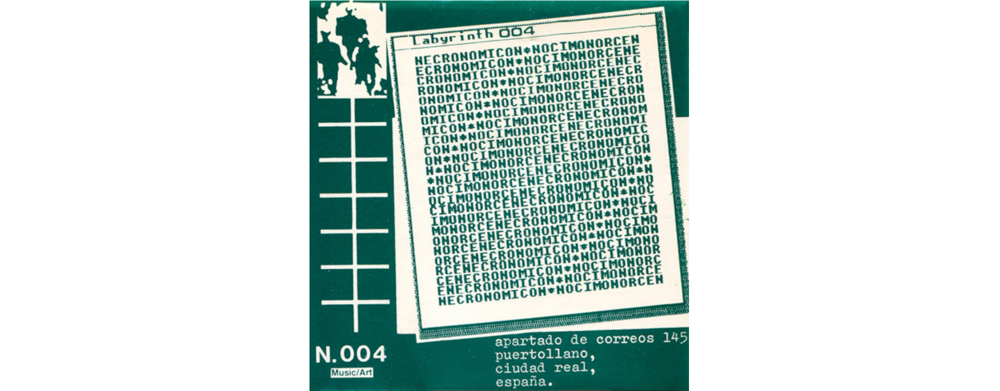
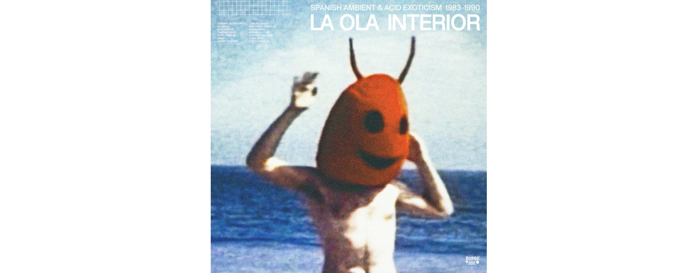

#### Necronomicon. 1987
  

- Las Puertas Del Infierno 0:53
- Contra El Mal 0:57

>De todas las recopilaciones internacionales de música electrónica experimental que aparecieron en los años 80, Necronomicón fue la más conocida y difundida más allá de nuestras fronteras. Cada cassette iba acompañada de su correspondiente fanzine explicativo y fueron muchos los grandes nombres que pasaron por estas sagradas cintas, como Esplendor Geométrico, Muslimgauze, Diseño Corbusier, Bourbonese Qualk, Orfeón Gagarin, Nocturnal Emissions, Vox Populi!, Interacción, Avant Dernières Pensées, P16.D4, Francisco López, Merzbow, Das Synthetische Mischegewebe, Comando Bruno, DDAA, UHP, Twilight Ritual, Mataparda, Victor Nubla y un larguísimo etcétera de celebridades de las "Otras Músicas".

>del blog [Wet Dreams](https://stahlfabrik.blogspot.com/2018/02/va-necronomicon-1-2-3-4-1984-1987.html)

---

#### La Ola Interior. 2021
  

- Me llena la cachimba 01:21
- La papa suave 01:44 

Proyecto y notas de la recopilación : Loïc Diaz Ronda 

>La Ola Interior. Ambient & Acid Exoticism in Spain 1983-90. Bongo Joe Records. 
Una compilación que explora la faceta ambiental de la música electrónica española de los 80. Reúne a músicos de diversos orígenes y generaciones, que compartían el deseo de crear un paisaje sonoro inmersivo y de combinar la música electrónica con tradiciones musicales no occidentales... esta música se desarrolla en el territorio productivo de las músicas experimentales, y en particular en sus dos principales caldos de cultivo: la escena underground de la grabación en cinta y la de músicos-productores independientes.
>
>LA OLA INTERIOR reúne 20 piezas poco conocidas e innovadoras de la época dorada de la música electrónica española.

--> [Enlace a la web del álbum en Discos Bongo Joe](https://lesdisquesbongojoe.bandcamp.com/album/la-ola-interior-spanish-ambient-acid-exoticism-1983-1990)

---
