Hacia 1985 más o menos empecé a comprar cámaras. Eso fue en Barcelona, donde en ese momento había aún un Rastro en unos descampados en lo que se llamaba Los Encantes, además de otros como el Mercado de los Pájaros, en una ciudad que desapareció. Cámaras viejas, antiguas, usadas y en desuso, que no se habían usado nunca, otras donde vivían cucarachas, de juguete, negras, azules, metálicas, oxidadas, de plástico, de baquelita. Casi todas baratas, muchas de ellas feas. Lo que yo llamaba cámaras-basura. Basura con cariño, sin juzgar. Luego también se llamó _foto pobre_.

No las compraba para coleccionarlas sino para usarlas, transformarlas, romperlas, quererlas, maltratarlas, acariciarlas, llevarlas de viaje. a Venecia me llevé aquella Lomo Lubitel, que no volví a usar , de formato medio, doble objetivo, una imitación rusa de las imitaciones malas de la Yashica que imitaba a la Rolleiflex; a Lisboa llevé la Diana, a Londres también; a Arlés me llevé una soviética que parecía sacada de una película de 1965; a Florencia me llevé una Capta de baquelita. Cada cámara distinta en su manera de enseñarme a ver el mundo. Sus limitaciones eran también virtudes y rasgos de estilo: viñeteados, borrosidad, desenfoque, granulosidad, aberraciones cromáticas. Y la Diana, el nombre de la Brownie Chiquita, la forma arquitectónica de la Brownie Baby de baquelita, las líneas elegantes de la Purma.

En algún punto las cámaras se quedaron sin uso, la poética de la foto pobre me extenuó, renuncié a la fotografía. Cierto que estuve dedicado a otros trabajos. 

Una década después reinicié esa relación con cámaras digitales, tuve la suerte de encontrar la Harinezumi, que venía siendo una versión japonesa de las cámaras pobres. Esa camarita me ayudó. Y las cámaras de algunos teléfonos móviles, y luego vinieron la Yashica Y35, la Necono, la Bonzart Ampel, la Lit, la Toy Block, la Sun and Cloud, la Jollylook, la Chuzhao, además de una cierta e incimprendida investigación en estenopeicas digitales. Usar Instagram y luego abandonarla. Investigar la zona entre fotografía, vídeo y time lapse. La postfotografía.

En la década de 1980 escribí _“usar una cámara de juguete era un ejercicio de humildad, como bucear sin gafas ni aletas ni tubo, como dibujar sólo con un lápiz y un trozo de papel, despojarse de la tecnología”_. Con la fotografía digital, seguramente incluso con la postfotografía, podría pensar que básicamente no he hecho otra cosa en toda mi vida.

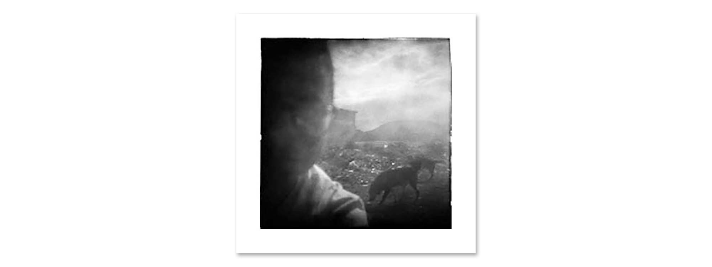

#### [Perro](https://mataparda.github.io/lff/perro) - 1990

---

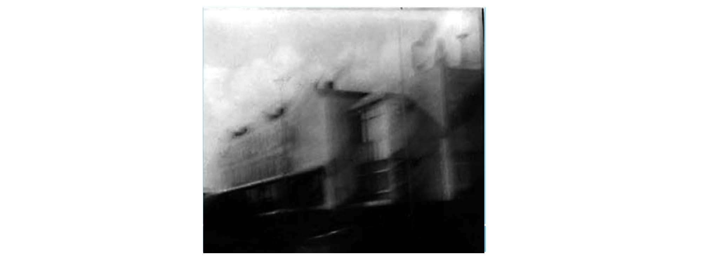

#### [Desde el coche](https://mataparda.github.io/lff/desdeelcoche) - 1990

---

#### [Mi viaje con Ledru](https://mataparda.github.io/lff/miviajeconledru) - 1990

---

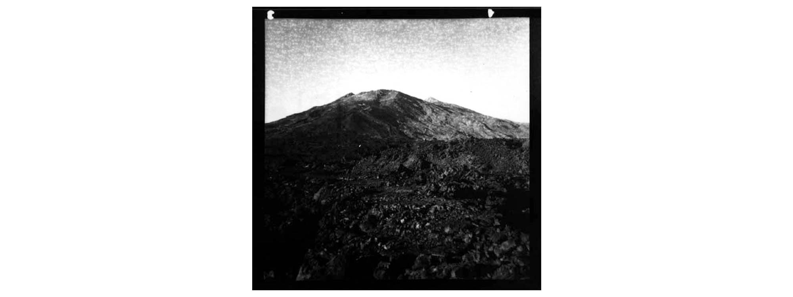

#### [Corona roja / El rey dormido](https://mataparda.github.io/lff/coronaroja) - 1996/1998

---

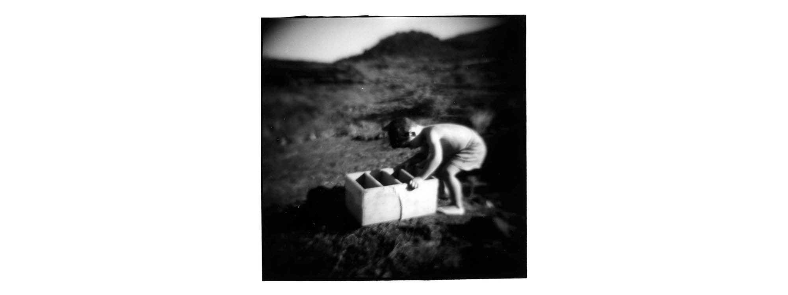

#### [La Zona - El cuarto de los sueños](https://mataparda.github.io/lff/lazona) - 1997

---

#### [Mi viaje con L.](https://mataparda.github.io/lff/miviajeconl) - 2021

---

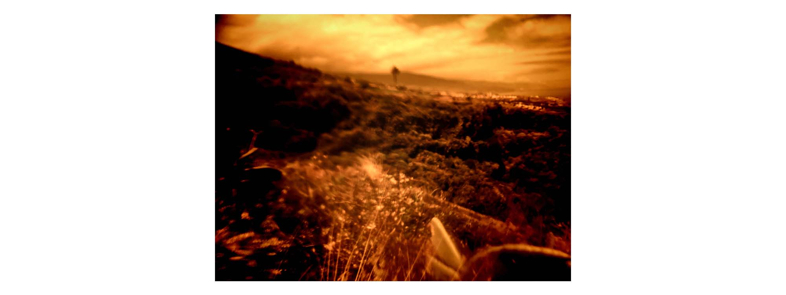

#### [Morfología de los restos de un viaje](https://mataparda.github.io/lff/morfologia) - 2022

---

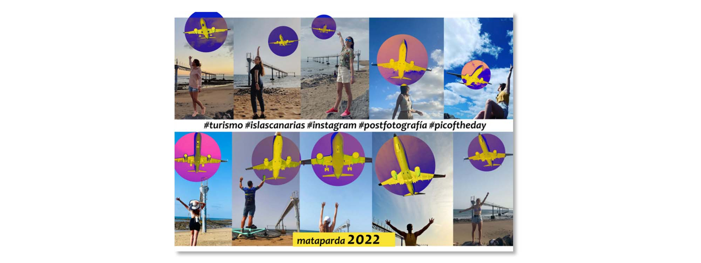

#### [#instagram @islascanarias @turismo #postfotografía #picoftheday](https://mataparda.github.io/lff/turismoislascanariasinstagram) - 2022

---

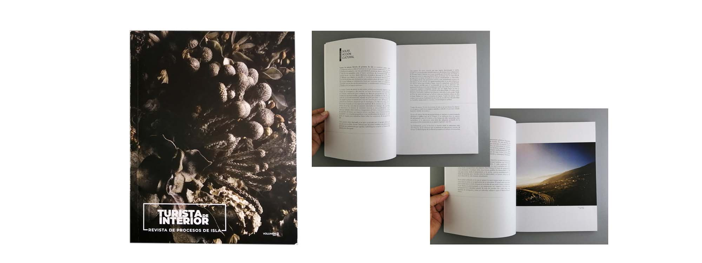

#### [SOLAR - Turista de interior, revista de procesos de isla](https://mataparda.github.io/lff/solar) - 2018-2023

---

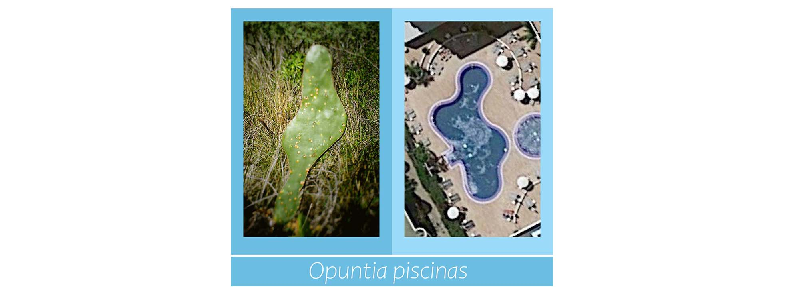 

#### [Opuntia piscinas](https://mataparda.github.io/lff/opuntiapiscinas) - 2024

---

---

### Trabajos inacabados

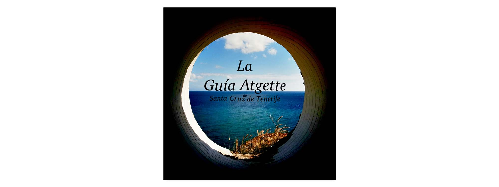 

#### [La Guía Atgette de Santa Cruz de Tenerife](https://mataparda.github.io/lff/laguiaatgette) - 2011-

---

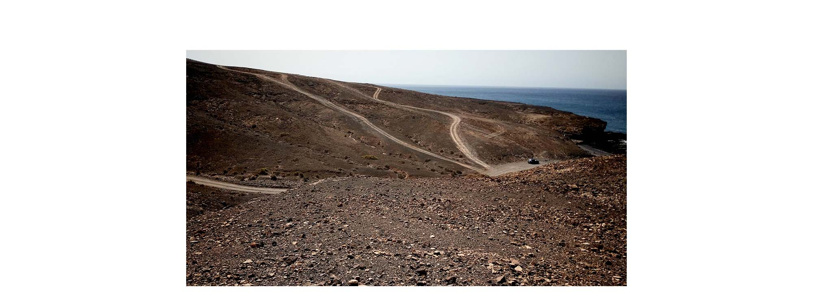 

#### [Fuerteventura](https://mataparda.github.io/lff/fuerteventura) - 2016-

---

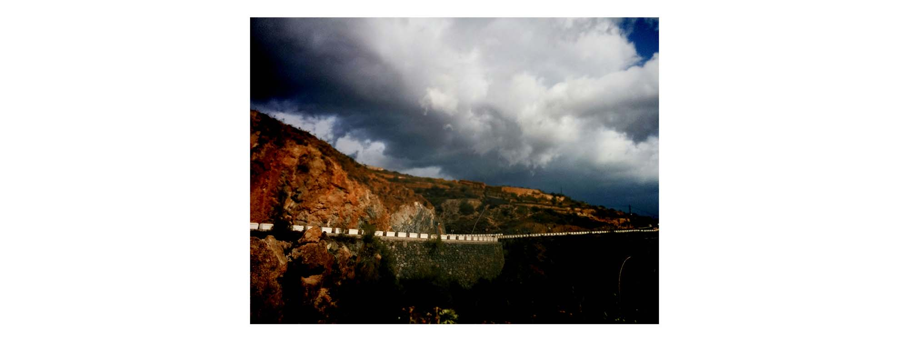 

#### [C-822](https://mataparda.github.io/lff/c822) - 2018-

---
